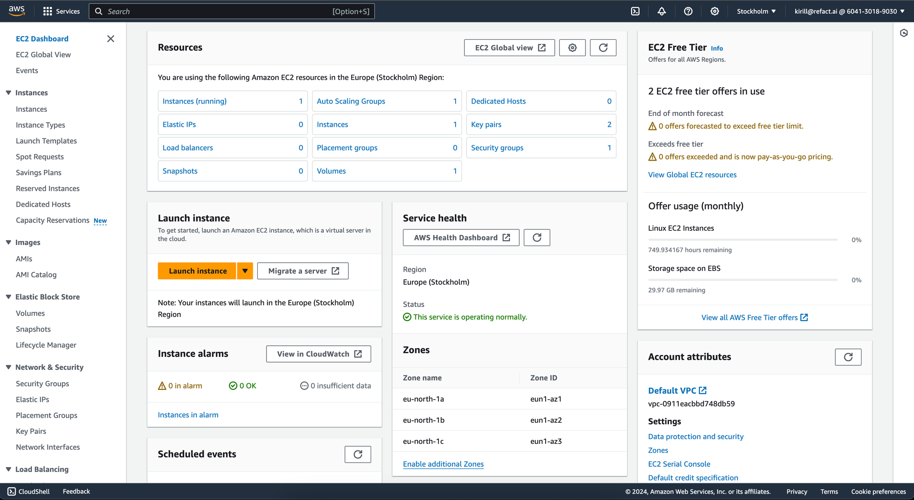
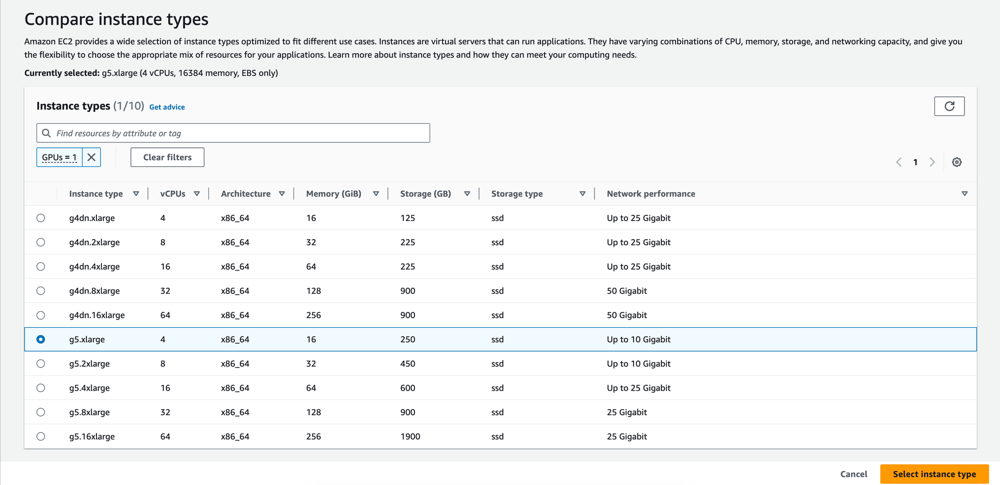
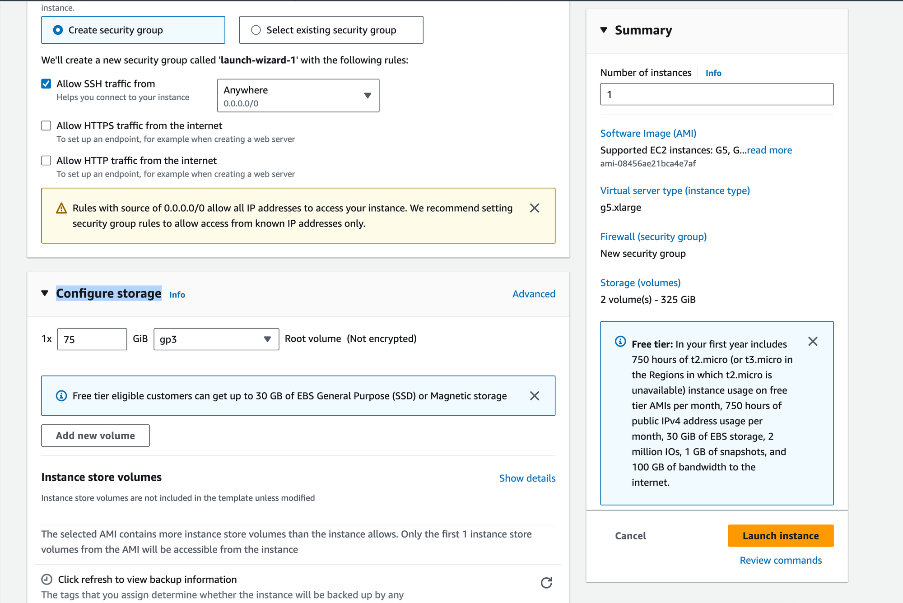
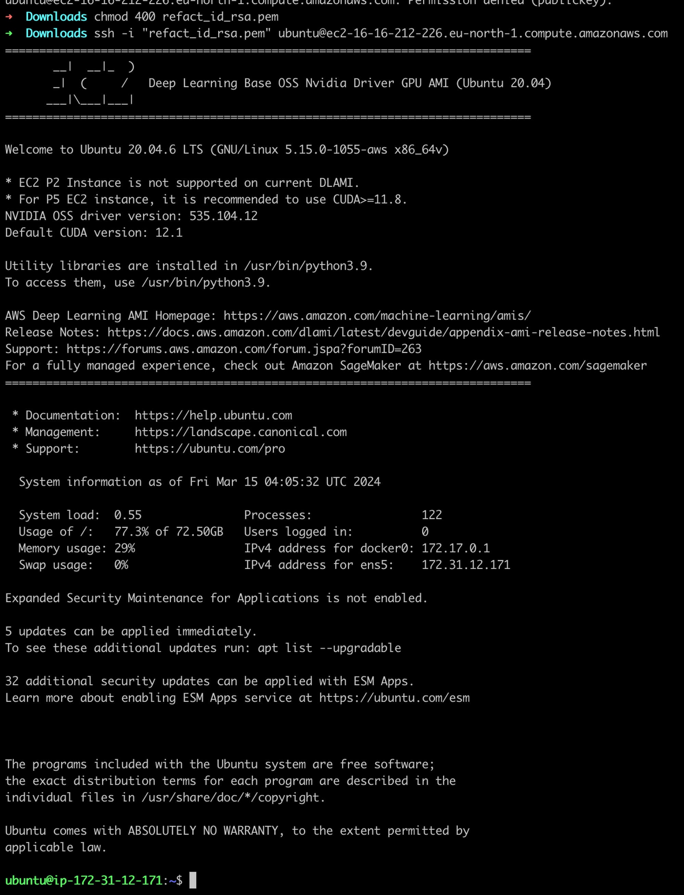

This guide provides step-by-step instructions for deploying Refact on AWS.

## Prerequisites
- An AWS account

## Log into AWS
1. Navigate to the AWS Console.
2. Log in using your credentials.
3. Locate and select the EC2 Service to access the EC2 Dashboard.



## Create a Key Pair
1. In the EC2 Dashboard, find the `Key Pairs` option in the sidebar under `Network & Security`.
2. Click on Create Key Pair.
3. Name your key pair (e.g., `refact_id_rsa`) and create it.
4. Download the key pair file (`.pem` file) to your computer. 

:::note
This file is necessary for SSH connections to your EC2 instance.
:::


## Launch an EC2 Instance
1. Return to the Dashboard and click `Launch Instance`.
2. For the AMI selection, choose an Ubuntu server image that includes NVIDIA drivers. **Note**: Ignore the AMI options that come with PyTorch and TensorFlow pre-installed. We'll use Docker to manage all necessary packages. 
3. Click `Compare` instance types. Use the filter to select a GPU machine type according to your requirements. 
4. Proceed to select your previously created key pair during instance setup.
5. Under Network settings and Storage, you can stick with the default configurations or adjust according to your needs.
6. Click `Launch Instance` to deploy your Ubuntu server.



## Access Your EC2 Instance

1. After the instance is up and running, navigate to Instances in the sidebar to find your new machine. 
2. Locate the `Public IPv4 DNS` address for your instance (e.g., `ec2-16-16-212-226.eu-north-1.compute.amazonaws.com`).
3. Open a terminal on your computer and establish an SSH connection with the command:

```bash
ssh -i "/path/to/your/refact_id_rsa.pem" ubuntu@ec2-16-16-212-226.eu-north-1.compute.amazonaws.com
```
Replace `"/path/to/your/refact_id_rsa.pem"` with the actual path to your downloaded key pair file.

## Deploy Refact

Once connected via SSH, follow the instructions provided by the Refact.ai CLI to complete the setup and deployment of Refact.



Continue to the [Refact Enterprise](https://docs.refact.ai/guides/enterprise/) page to learn how to use Refact for teams.